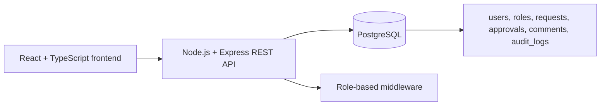

# Employee Workflow Management System

Resume-ready full-stack internal workflow management system for employees, managers, and admins. Employees submit internal requests, managers review approvals with comments, and admins monitor status, audit history, and workflow metrics.

## Repository

[https://github.com/rohitjoshi6/employee-workflow-management-system](https://github.com/rohitjoshi6/employee-workflow-management-system)

## Architecture



## Features

- Employees submit internal requests with type, priority, title, description, and due date.
- Managers view pending approval queues, approve or reject requests, and add comments.
- Admins track all request status, audit history, and workflow metrics.
- Role-based access for employee, manager, and admin workflows.
- Dashboards for pending approvals, completed requests, request history, and metrics.
- PostgreSQL schema, seed data, Docker Compose, REST API, React UI, reusable components, and tests.

## Tech Stack

- Frontend: React, TypeScript, Vite, CSS modules-style global styling.
- Backend: Node.js, Express, TypeScript, PostgreSQL via `pg`.
- Persistence: PostgreSQL with schema and seed SQL.
- Tests: Vitest, Supertest, React Testing Library.

## Quick Start

1. Copy environment values:

   ```bash
   cp .env.example .env
   cp .env.example backend/.env
   ```

2. Start PostgreSQL:

   ```bash
   docker compose up -d
   ```

3. Install dependencies:

   ```bash
   npm install
   ```

4. Start the API:

   ```bash
   npm run dev:backend
   ```

5. In a second terminal, start the frontend:

   ```bash
   npm run dev:frontend
   ```

The frontend runs on `http://localhost:5173` and the API on `http://localhost:4000/api`.

## Demo Users

The API uses the `x-user-id` header for demo authentication.

| Role | User | ID |
| --- | --- | --- |
| Employee | Maya Patel | `11111111-1111-1111-1111-111111111111` |
| Employee | Noah Kim | `22222222-2222-2222-2222-222222222222` |
| Manager | Elena Garcia | `33333333-3333-3333-3333-333333333333` |
| Admin | Priya Shah | `44444444-4444-4444-4444-444444444444` |

## API Routes

| Method | Route | Roles | Description |
| --- | --- | --- | --- |
| `GET` | `/api/health` | Public | Health check |
| `GET` | `/api/auth/me` | Any authenticated user | Current user profile |
| `GET` | `/api/requests` | Employee, manager, admin | Role-filtered request history |
| `POST` | `/api/requests` | Employee, admin | Create internal request |
| `GET` | `/api/approvals/queue` | Manager, admin | Pending approvals queue |
| `POST` | `/api/requests/:id/status` | Manager, admin | Approve, reject, or comment on request |
| `GET` | `/api/admin/audit-logs` | Admin | Audit trail |
| `GET` | `/api/admin/metrics` | Admin | Workflow metrics |

More details are in [docs/api.md](docs/api.md).

## Screenshots

Add screenshots here after running the app locally:

- Employee request submission dashboard
- Manager approval queue
- Admin audit and metrics dashboard

## Resume Bullet Points

- Built a full-stack internal workflow management system using React, TypeScript, Express, and PostgreSQL with role-based access for employee, manager, and admin workflows.
- Designed normalized PostgreSQL tables for users, roles, requests, approvals, comments, and audit logs, plus seed data for realistic demo scenarios.
- Implemented REST APIs for request creation, approval queues, status transitions, comments, audit history, and workflow metrics.
- Created reusable React components for dashboard cards, request forms, data tables, status badges, and role-aware views.
- Containerized PostgreSQL with Docker Compose and added environment examples, project documentation, and basic automated tests.

