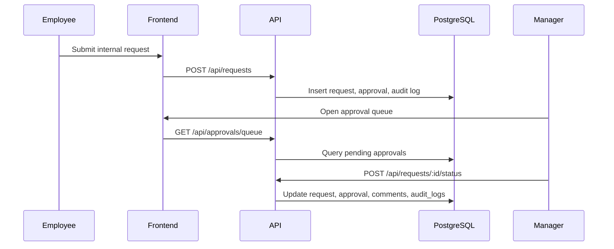

# Architecture

The system is split into three top-level folders:

- `/frontend`: React + TypeScript single-page application.
- `/backend`: Express + TypeScript REST API.
- `/docs`: architecture and API notes.

Role checks are enforced in backend middleware. The frontend exposes demo role switching, but the API still authorizes every protected route using `x-user-id`.

